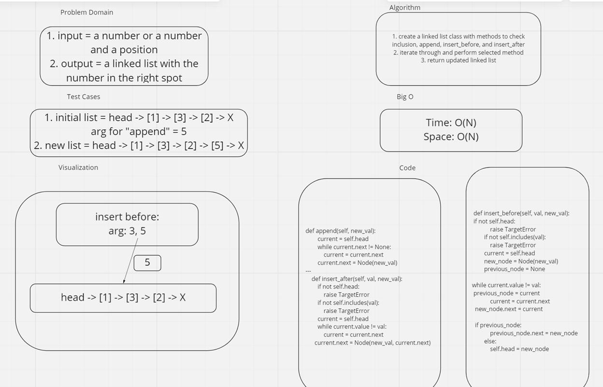

# Challenge Summary
- For this challenge, we added 3 methods to a singly linked list class: append, insert before, and insert after

## Whiteboard Process

## Approach and Efficiency
- I used a while loop for each method in this challenge
- Big O time:
  - append: O(N)
  - insert_before: O(N)
  - insert_after: O(N)
- Big O space: O(N)

## Solution
- see the "linked_list.py" file
