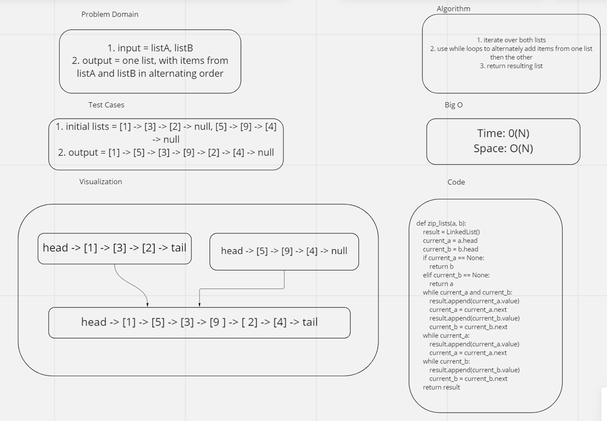

# Challenge summary
  - take as input two linked lists, and join their nodes in alternating order

## Whiteboard process

## Approach and efficiency
- I used 3 while loops to solve the problem
- Space complexity - O(N)
- Time complexity - O(N)

## Solution
- see the linked_list_zip.py file
