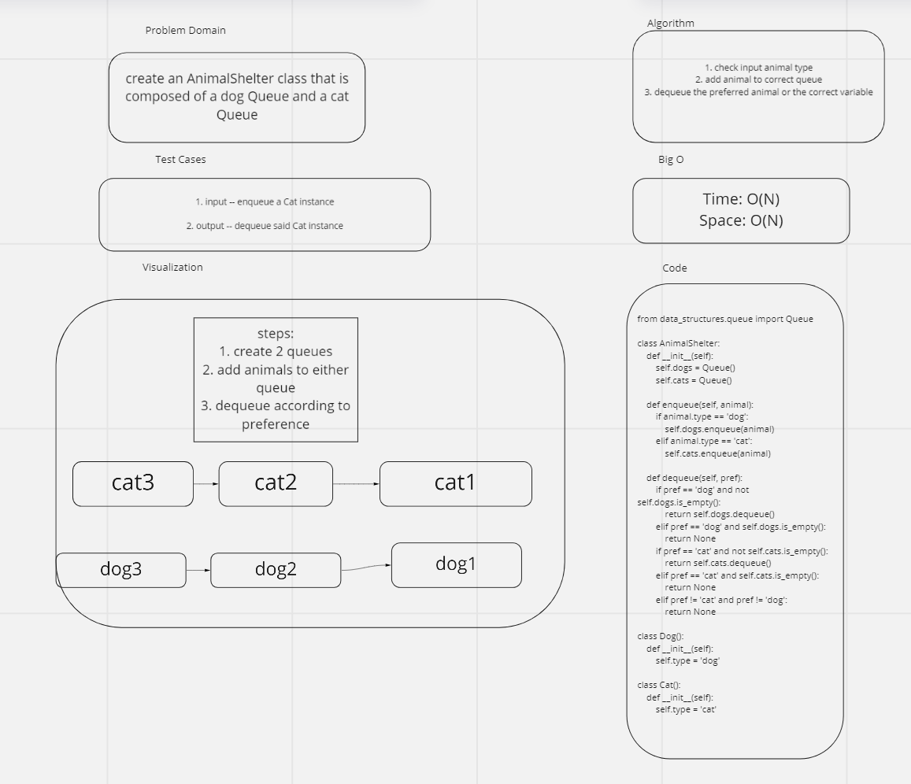

# Challenge Summary
- Implement an AnimalShelter class that acts a dual queue for cats and dogs

## Whiteboard Process

## Approach & Efficiency
<!-- What approach did you take? Why? What is the Big O space/time for this approach? -->
- I used a series of if/else statements to enqueue or dequeue the correct animal via the correct queue; I chose this method because it worked
- Big O time: O(N)
- Big O space: O(N)

## Solution
- see the attached whiteboard
