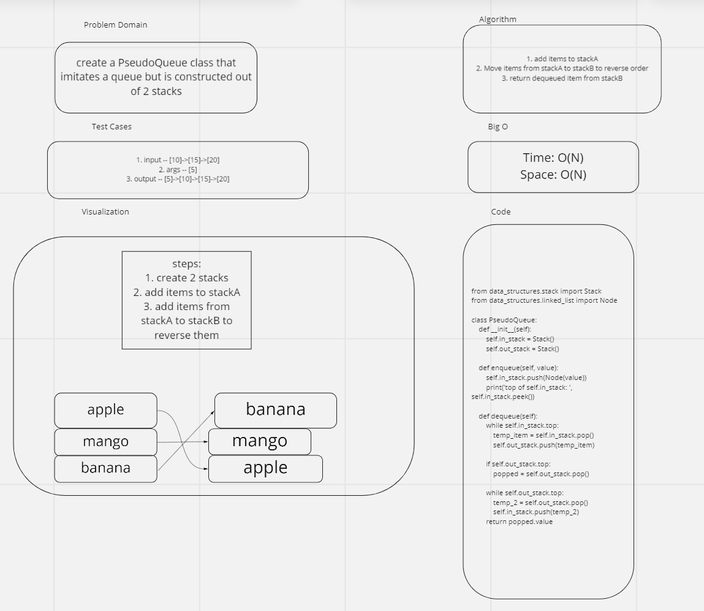

# Challenge Summary
- Implement a queue using two stacks

## Whiteboard Process

## Approach & Efficiency
<!-- What approach did you take? Why? What is the Big O space/time for this approach? -->

- I used while loops and conditionals to create the required methods
Big O space: O(N)
Big O time: O(N)

## Solution
- see the attached whiteboard
