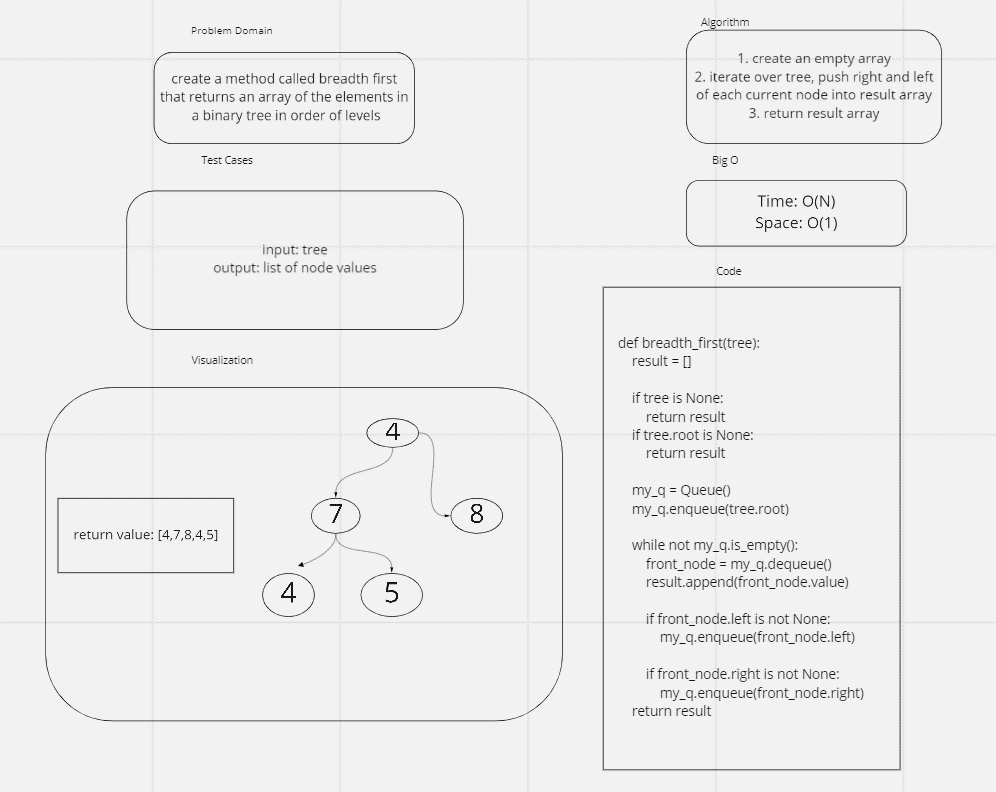

# Challenge Summary
- switch values on a tree according to fizzbuzz pattern

## Whiteboard Process

## Approach & Efficiency
- I created a queue then used loops/conditionals
- I used this approach because it worked
- the big O space is O(N)
- big O time: O(1)

## Solution
- see whiteboard
