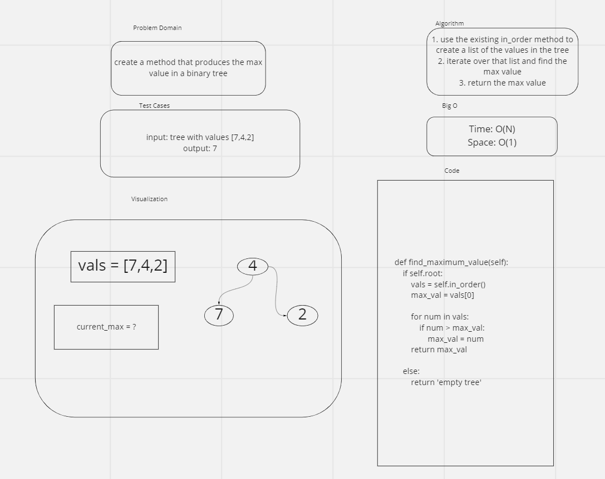

# Challenge Summary
- find the max value in a binary tree

## Whiteboard Process

## Approach & Efficiency
<!-- What approach did you take? Why? What is the Big O space/time for this approach? -->
- for this method, I called one of the existing traversal methods on the tree and compared each node's value to a max. Then, after traversal ended, I returned the max. I chose this because it was an efficient method.
- Big O time: O(N)
- Big O space: O(1)

## Solution
- see attached whiteboard
