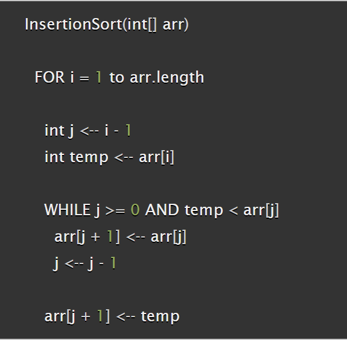
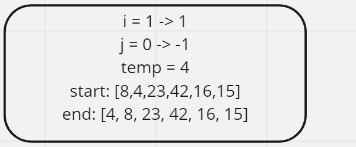
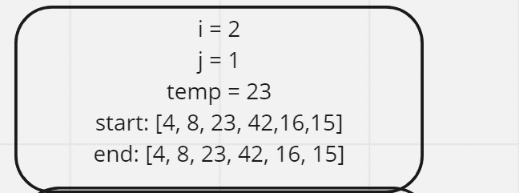
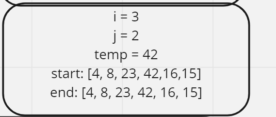
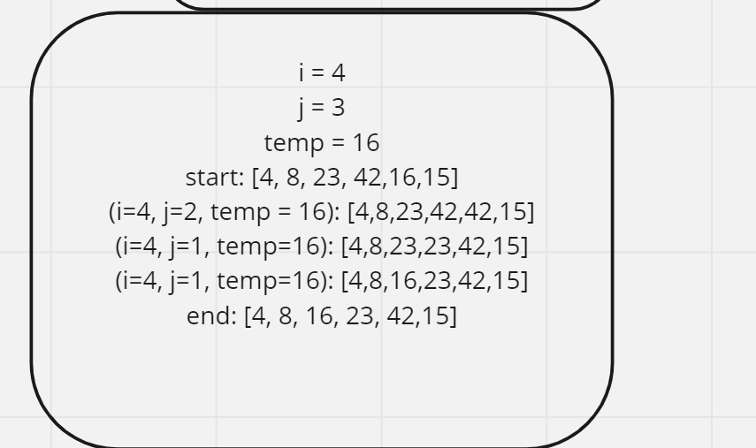
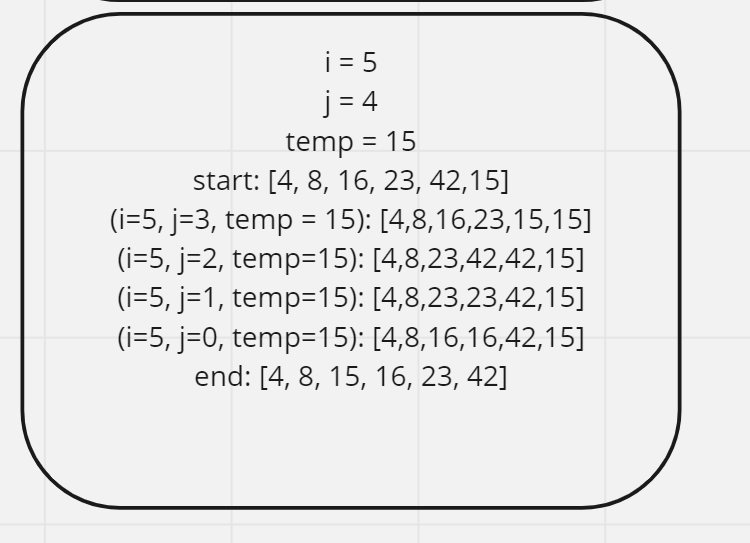

# Blog Notes: Insertion Sort
- this type of sorting iterates through the array, storing a current element (which starts at index 1) and comparing it to all previous values.
- the current element is moved to the position where it is larger than the value to the left and smaller than the one to the right

## Pseudocode:

## Trace/Steps:
- increase i by 1 each step

- i starts at 1
- compare value at index 1 (4) with value at index 0 (8)
- overwrite 4 with 8
- decrease j to -1
- put temp value (4) at index 0

- i is now 2
- temp is 23
- 23 is higher than 8, sorted already
- keep temp at 23

- i is now 3
-temp is 42
- save temp as 42 again, as this is already sorted

- i is now 4
- temp is 16
- overwrite index 4 with index 3 (42)
- overwrite index 3 with index 2 (23)
- set index 2 as temp value (16)

- i is now 5
- temp is 15
- overwrite index 5 with index 4 (42)
-overwrite index 4 (42) with 23
- overwrite index 3 (23) with 16
-set index 2 as 15

- final: [4,8,15,16,23,42]

## Big O:
- Time: O(N^2)
- Space: O(1)

